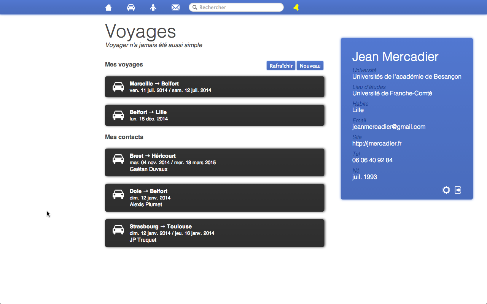
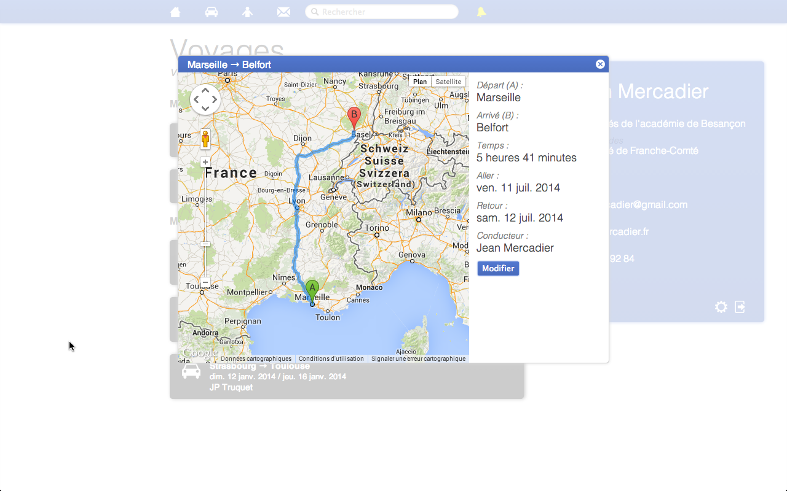
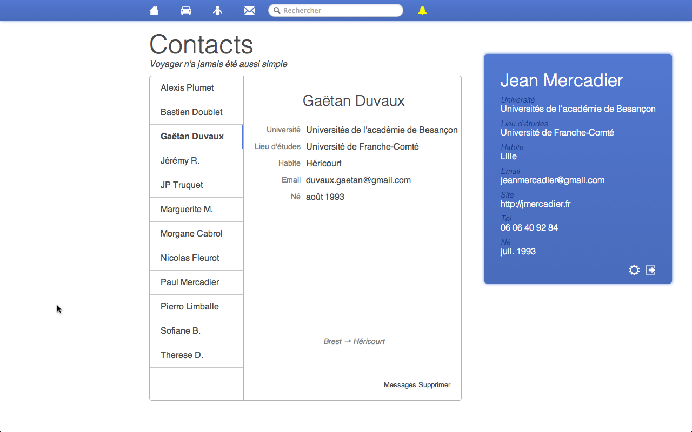
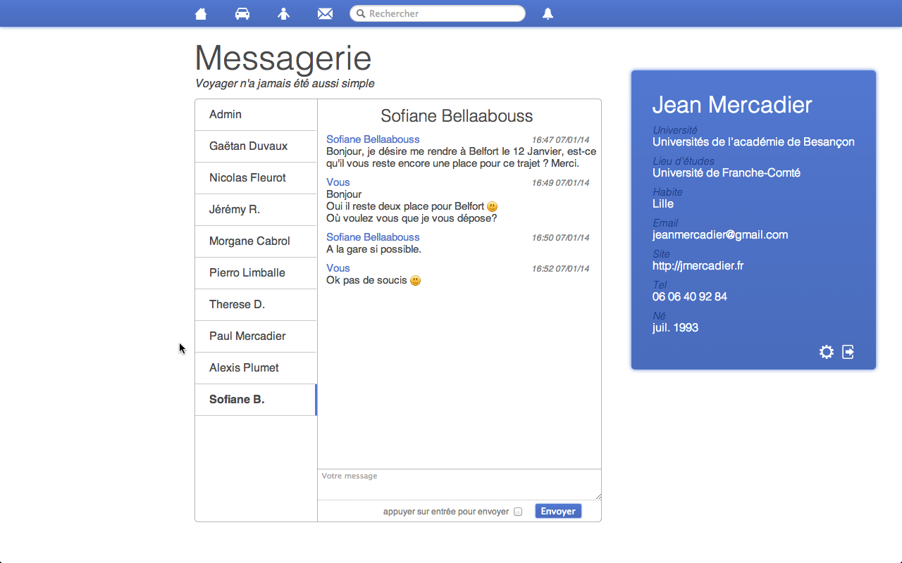
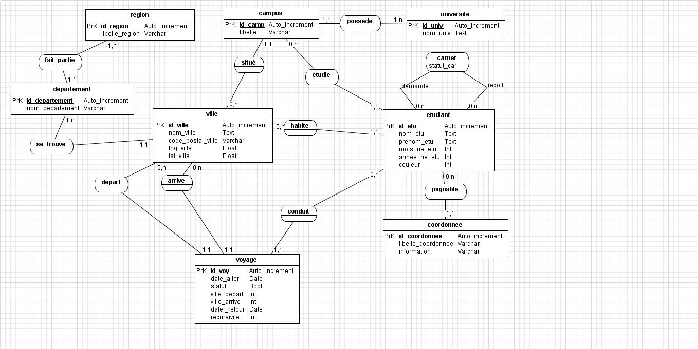

# Rapport de Projet

Plan noté en cours:

1. intro
	- présente du contexte en qq ligne
	- annonce du plan	
2. **presentation contexte + sujet** (très important, 4 à 5 pages)
	- du general au particulier
	- ex: entreprise → service → besoins → sujet (contact → sujet)
3. cahier des charges
	- le plus simple à rédiger 
	- fonctions attendus
	- pour qui (utilisateur)
	- comment
4. réalisation
	- qq capture d'écrans (4 ou 5 maxi) (important)
5. bilan + planning
	- planning du début et planning de la fin
	- bilans: humain + technique + pédago
6. conclusion
	- synthése
	- ouverture
	- **se termine bien**
	
Lors de mes différentes sortie sur Belfort j'ai eu l'occasion de discuter avec beaucoup d'étudiant venant de toute la région qui se plaignaient du manque de transport pour rentrer chez eux. Dans ce contexte j'ai eu l'idée réaliser un site de covoiturage pour les étudiants plus spécialement de l'Est de la France. Dans ce contexte nous verrons en details les attentes des étudiant et d'un tel site, le cahier des charges puis finalement le rendu travail plus le bilan de ce projet.

## Présentation

Le projet consiste à réaliser un site de covoiturage pour les étudiants de l'Est de la France afin qu'ils puissent trouver des voyages pour rentrer chez eux les week-end. Pour cela ils ont besoin de se faire un carnet d'adresse afin de rester en contact avec les gens prés de chez eux. 

Ce genre d'application peut être bénéfique à toute association étudiante et peut meme être mit en place par une organisation uniquement dédier à cette activitée.

En rassemblant toutes ces informations, il semble evident de créer un site orienté réseau social avec un moteur de recherche permettant de trouver les personnes avec qui on peut covoiturer. Nous avons mit en place ce servie avec une idée simple: le conducteur propose un voyage et ses contacts sont averti de ce voyage et peuvent donc rentrer en contact avec le chauffeur.

## Cahier des charges

Ce site est destiné au étudiant et donc à un publique jeune qui a une experience des ordinateurs.

L'application doit être réalisée en PHP/javascript/SQL. Elle doit fonctionner sur un serveur Apache et sur un environnement Linux. La base de donnée doit être créer à partir d'un script sql.

Ce site doit remplir les different points:

1. Intuitif : l'application doit pourvoir s'utiliser sans avoir besoin de lire la documentation. Pour cela il faudra une interface propre.
2. Pour les étudiants: la base de donnée doit intégrer la liste des université afin de pouvoir regrouper les étudiants.
3. Simple: un conducteur propose un voyage et toute personne peut rentrer en contact avec cette étudiant.
4. En France: les voyage peuvent aller de n'importe quelle ville en France.
5. Voyage récurent: si un étudiant rentre chez lui tout les week-end, il peut proposer sont voyage de manière récurrente tout les sept jours.
6. Les voyages des contacts: tout utilisateur peut consulter les voyages proposé par ses contacts dans la page voyage.
7. Carnet d'adresse: une interface pour consulter ses contact est obligatoire afin de trouver les informations de contact.
8. Demande de contact: il est possible de trouver et demander en contact tout autre utilisateur.
8. Recherche: il est possible de rechercher un voyage ou un étudiants dans la base de donnée.
9. Information personnelle: conformément à la CNIL il est possible de modifier et supprimer ses information personnelle, mais aussi d'en ajouter.
10. Mot de passe: le mot de passe doit être crypté et doit pouvoir être changé.
11. Compte: il es possible de créer et de supprimer son compte. 

Il nous a donc semblé évident de réaliser un réseau social avec un système de notification.

## Réalisation

Le cahier des charge a été remplie dans son intégralité, nous avons même réalisé des options qui n'était pas demandé comme l'adaptation de la couleur principale en fonction de l'utilisateur ainsi qu'un système de messagerie privée.

### Résultat

Nous avons donc les pages suivante:

1. Page de connextion
1. Home
2. Voyages
3. Contacts
4. Messages
5. Recherche
6. Profile

#### Page de connection

La page de connexion comme son nom l'indique permet de se connecter à son compte ou de créer un compte.

En plus des fonctionnalités de cette page, nous avons affiché le nombre d'utilisateur à coté du formulaire d'inscription.

#### Home

Une fois connecté, l'utilisateur arrive sur la page home et se voit proposer quatre lien qui corresponde aux quatre pages principales du site à savoir Voyages, Contacts,  Messages, et Recherche.

L'utilisateur peut aussi voir la bar de navigation et une boite resumument ses information personnelles. Ces deux dernier éléments seront présent dans tout le reste du site.

#### Voyages

La page voyage contient l'intégralité des voyage proposé par l'utilisateur en plus des voyages des contacts de l'utilisateur.

Pour afficher une voyage, il suffit de cliquer dessus et une popup s'affiche avec une carte Google Map, et les différente information du voyage comme le temps approximatif, les différentes dates des trajet ainsi que la récurrence si les trajets se répètent.

#### Contacts

Cette page est probablement la plus classique dans sa presentation. On trouve en effet une liste de contact sur la gauche et en sélectionnant un nom on affiche les information de cette personne. On peut également retrouver les voyages de cette personne si elle en propose.

#### Messages

Le système de messagerie a était en parti copiée de Facebook concernant le style. Sinon on retrouve l'interface utilisé pour la page contact.

### Base de donnée

Ce MCD nous fait un total de 10 tables.

#### Sources

Afin d'avoir une base de donnée la plus complete possible, nous avons téléchargé un script sql avec toute les villes de France et nous avons également récupéré la liste de toute les université publique que l'on a trouvé sur le site de l'éducation national. Ces données sont nécessaire à la verification des information fourni par les utilisateur mais permettent aussi d'émettre des suggestions lorsqu'un utilisateur tapes les premiere lettre du nom d'une ville ou d'une universités.

Avec les données du script des villes de France nous obtenue la longitude et la latitude de chaque commune. A partir de ces donné nous avons pu intégrer Google Map.

#### Spécificité

##### Identification des utilisateurs

Afin de pouvoir gérer l'identification par mail de l'utilisateur. Tout étudiant doit avoir au moins une adresse mail et donc avoir une occurrence de l'entité coordonné lié à l'occurrence étudiant.

##### Attribut de l'association carnet

`statut_car` dans l'association carnet représente le statut de la relation entre les deux étudiant. Cet entier est nulle quand la demande de contact a été envoyé mais le deuxième étudiant n'a pas encore refusé ou accepté. Dans le cas d'un refus, l'occurrence de carnet est supprimé, dans le cas contraire le status est mit à un.

##### Notion de récursivité

La récursivité d'un voyage est représenté par le l'attribut `recursivite` dans la table `voyage`. Cet entier correspond à l'interval de temps en jours entre chaque repetition du voyage. Il est donc forcement positif cependant il prend une valeur de zero quand le voyage en question n'est pas récursif.

##### Retour

La date de retour dans l'entité voyage est le seul attribut propre au retour du voyage. Si un voyage ne présente pas de retour, la date est mise à zero soit `0000-00-00`.

### Moyen utilisé

Le site dans sont intégralité a été implémenté avec les languages suivant:

- PHP (55.5%)
- SQL
- JavaScript/JQuery (30.1%)
- HTML/CSS (13.0%)
- ShellScript (1.4%)

La répartition du code nous est donné grace à GitHug sur le quelle nous avons hébergé le projet:

[https://github.com/Ricain/CoEtu](https://github.com/Ricain/CoEtu)

#### Google Map

Afin situer les villes nous avons utilisé l'API de Google Map pour mieux visualiser les voyage. Cela nous permet aussi de calculer approximativement le temps nécessaire à aller du point de départ au point d'arrivé.

#### JSColor

[http://jscolor.com/](http://jscolor.com/)

JSColor est un JavaScript licencié GNU qui permet au développer web d'intégrer un "color picker" dans leur site. Ce service est important pour notre application car nous proposons aux utilisateurs de personnaliser leur compte en modifiant la couleur principale du site à leur plein grès.

## Bilan

### Planning

#### Initial

Nous avions initialement divisé notre projet en quatre étapes.

1. Création du MCD (1 semaine)
2. Création de la base de donnée avec un fichier SQL (2 semaines)
3. Début de l’implémentation des fonctions basiques comme créer un compte, interface de connexion, consulter ses infos… (3 semaines)
4. Implémentation des fonctions complexes comme l’interface de voyage, le carnet d’adresse, le formulaire de recherche… (reste du temps)

Afin de respecter ces étape, nous avons commencé le projet sur plusieurs front, c'est à dire que l'on a divisé le groupe en deux, le premier sous groupe s'occupait de créer la base de donné pendant que le deuxième s'occuper de faire la maquette du site. Un fois ces deux éléments fait il ne reste plus qu'a faire le lien en atomisant le HTML des maquettes avec le PHP. 

#### Final

Nous avons donc respecté le processus précédant mais nous mit en place toute les fonctionnalité demandé dans le cahier des charges bien plus rapidement que prévu. Dans ce contexte nous avons donc décidé de rajouter une grande quantité de fonction tel que:

- la couleur ajustable en fonction de l'utilisateur
- le remplacement de l'ajax par des websockets
- les photo de profile
- un système de messagerie interne

Comme on peut le voir certaine de ces fonctionnalité ont pu être amendé sur l'application.

L'objectif était de finir le projet cinq jour avant la soutenance afin de pourvoir écrire les rapports. Il est difficile de dire si cette objectif a été atteint car même si nous sommes arrivé un à un site tout à fait convenable niveau fonctionnalité, nous avons été confronté à de nombreuse correction de bug qui nous a forcé à modifier le code source jusqu'a la fin.

### Technique

Même si nous n'avons utilisé que des langages appris en cous, nous avons énormément appris dans l'organisation d'un avec une base un peu plus grand que d'habitude. Nous avons mit en place une base de donné assez conséquente ainsi que diffèrent scripts... 

### Humain

Pour finir le projet nous avons du nous organiser 