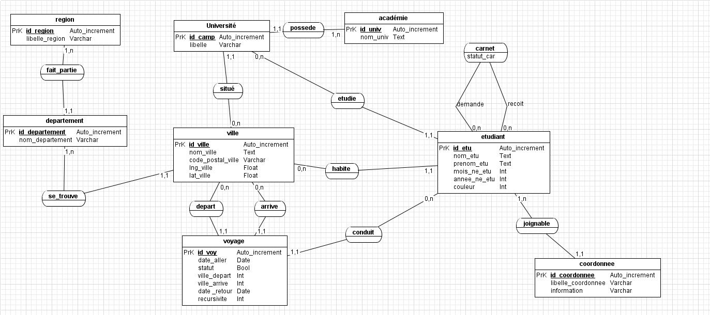

# Rapport de Projet
	
Lors de mes différentes sortie sur Belfort j'ai eu l'occasion de discuter avec beaucoup d'étudiant venant de toute la région qui se plaignaient du manque de transport pour rentrer chez eux. Dans ce contexte j'ai eu l'idée réaliser un site de covoiturage qui réglerait ce problème. Pour cela nous verrons en détails les attentes des étudiants ainsi que les fonctionnalité qu'un site de ce genre se doit de proposer, finalement le rendu travail plus le bilan de ce projet.

## Présentation

Le projet consiste à réaliser un site de covoiturage pour les étudiants de l'Est de la France afin qu'ils puissent se déplacer dans la région. Cependant le principale besoin reste de pouvoir rentrer chez sois les week-end.

L'état actuelle des chose fait qu'un étudiant qui a besoin d'un tel service va se tourner vers les contacts du lycée qui sont dans la même universités que lui si il y en a. Sinon il cherchera parmi ses amis. Cependant un nouveau arrivant ne possède pas tout de suite un bon groupe d'amis. On remarque donc qu'au fil des premiers mois de l'année universitaire un véritable réseau se crée afin que chaque personne ai un carnet d'adresse le plus complet possible pour rentrer chez sois dans les meilleure conditions possible.

Cependant il est assez fréquent que les étudiants concerné par ce probléme se tournent vers des sites déjà existant comme [blablacar.fr](blablacar.fr). C'est d'ailler le seul moyen de trouver d'autre étudiant dans la même ville mais dans des université différente. En effet il n'existe pas de servies interuniversités permettant aux étudiant de toute la ville et de la région de rentrer en contact.

L'idée de ce projet consiste à créer un site de covoiturage qui ferait aussi site de rencontre dédié aux étudiant de la région. Il fonctionnerai d'une manière simple: le conducteur propose un voyage et ses contacts sont averti de ce dernier et peuvent donc communiquer avec le chauffeur.

Le concepte est que chaque étudiant puisse se construire un carnet d'adresse grâce à cette application et n'ai plus de problème à covoiturer pour rentrer chez eux les premier mois de leur scolarité.

## Cahier des charges

Il est claire que le publique visé sont les étudiants, un publique jeune et famillilé avec les ordinateurs et les réseaux sociaux.

L'application doit être réalisée en PHP/javascript/SQL. Elle doit fonctionner sur un serveur Apache et sur un environnement Linux. La base de donnée doit être créer à partir d'un script sql.

Ce site doit remplir les different points:

1. Intuitif : l'application doit pourvoir s'utiliser sans avoir besoin de lire la documentation. Pour cela il faudra retrouver une interface propre de réseau social.
2. Pour les étudiants: la base de donnée doit intégrer la liste des université afin de pouvoir regrouper les étudiants.
3. Simple: un conducteur propose un voyage et toute personne peut rentrer en contact avec cet étudiant.
4. En France: les voyages peuvent partir et arriver dans n'importe quelle commune en France.
5. Voyage récurent: si un étudiant rentre chez lui tout les week-end, il peut proposer sont voyage de manière récurrente tout les sept jours.
6. Les voyages des contacts: tout utilisateur peut consulter les voyages proposé par ses contacts.
7. Carnet d'adresse: une interface pour consulter ses contact est obligatoire afin de trouver les informations de contact.
8. Demande de contact: il est possible de trouver et demander en contact tout autre utilisateur.
8. Recherche: il est possible de rechercher un voyage ou un étudiant dans la base de donnée.
9. Information personnelle: conformément à la CNIL il est possible de modifier et supprimer ses information personnelle, mais aussi d'en ajouter.
10. Mot de passe: le mot de passe doit être crypté et doit pouvoir être changé.

L'interaction avec l'utilisateur est laissé à la discrétion du développer.

## Réalisation

Le cahier des charge a été remplie dans son intégralité, nous avons même réalisé des options qui n'était pas demandé comme le choix de la couleur principale du site à l'utilisateur ainsi qu'un système de messagerie privée.

### Résultat

Nous avons donc les pages suivante:

1. Page de connexion
1. Page d'accueil (Home)
2. Voyages
3. Contacts
4. Messages
5. Recherche
6. Profile

#### Page de connection

La page de connexion comme son nom l'indique permet de se connecter à son compte ou de créer un compte.

En plus des fonctionnalités de cette page, nous avons affiché le nombre d'utilisateur à coté du formulaire d'inscription.

#### Home

Une fois connecté, l'utilisateur arrive sur la page Home et se voit proposer quatre lien qui corresponde aux quatre pages principales du site à savoir Voyages, Contacts,  Messages, et Recherche.

L'utilisateur peut aussi voir la bar de navigation et une boite résument ses informations personnelles. Ces deux dernier éléments seront présent dans tout le reste du site.

Cette page d'accueil est probablement la plus vide du site. Il est en effet possible de rajouter un "fil d'actualité", des suggestions de contact ou de voyage en fonction des données personnelle de l'utilisateur ou tout simplement de la publicités. (Ces élément ne faisant pas parti du cahier des charges)

#### Voyages

La page voyage contient l'intégralité des voyages proposés par l'utilisateur en plus des voyages des contacts de l'utilisateur.

Pour afficher une voyage, il suffit de cliquer dessus et une popup s'affiche avec une carte Google Map, et les différentes informations du voyage comme le temps approximatif, les différentes dates des trajets ainsi que la récurrence si les trajets se répètent.

Le formulaire de création et modification des voyages intègre les suggestion des ville de France dont les noms sont récupéré dans la base de donnée. De plus tout les voyages passés non répétitif sont automatiquement supprimé. Les voyage répétitif passé se voit incrémenter  leur date par le nombre de jour correspondant à la récursivité.

#### Contacts

Cette page est probablement la plus classique dans sa présentation mais la plus importante car elle est le coeur des fonctionnalité de l'application. On trouve une liste de contact sur la gauche, en sélectionnant un nom on affiche les information de cette personne. On peut également retrouver une lien pour envoyer un message à cette personne plus ses voyages si elle en propose.

#### Messages

Le système de messagerie a était en parti copiée de Facebook concernant le style. Sinon on retrouve l'interface utilisé pour la page contact. Il est possible d'envoyer des liens et des smiley. De plus les retour à la ligne sont prit en compte

### Charte graphique

Le site est constitué de trois couleurs principales: le blanc, un gris noirs et une dernière couleur laissé au choix de l'utilisateur, par défaut il s'agit d'un bleu ciel.

On retrouve deux polices utilisé, une pour les block de texte et une autre pour les libellé et les titres. La première s'intitule proxima-nova, et la deuxième est omnes-pro sur la quelle on minimise la largeur des caractères.

Les images utilisés représentent les différente pages ou les différentes actions proposé à l'utilisateur et sont utilisé sous forme d'icône.

1. La bar de navigation est fixe, sa hauteur est de 38 pixels sans l'ombre.
2. Le titre de la page plus le slogan a une hauteur fixe de 55 pixels
3. La hauteur du contenu de la page varient en fonction de ce qu'elle contient. Les cadres dans les pages contacts et messages on une taille variable qui correspond à 75% de la hauteur de la page.
4. La largeur du contenue est de 45% de l'écran dans tout le site.
5. La hauteur de la boite d'information personnelle varie en fonction de son contenue.
6. La largeur de la boite d'information personnelle varie également en fonction du contenue de cette boite qui est positionné à gauche du contenue et non à  droite de l'écran.

### Base de donnée

Ce MCD nous fait un total de 10 tables.

#### Sources

Afin d'avoir une base de donnée la plus complète possible, nous avons téléchargé un script sql avec toute les villes de France et nous avons également récupéré la liste de toute les universités publiques que l'on a trouvé sur le site de l'éducation national. Ces données sont nécessaire à la vérification des informations fournies par les utilisateurs mais permettent aussi d'émettre des suggestions lorsqu'une personne tapes les première lettre du nom d'une ville ou d'une universités dans un champ réservé à cet effet.

#### Spécificité

##### Identification des utilisateurs

Afin de pouvoir gérer l'identification par mail de l'utilisateur lors de sa connexion. Tout étudiant doit avoir au moins une adresse mail et donc avoir une occurrence de l'entité coordonné lié à l'occurrence étudiant.

##### Attribut de l'association carnet

`statut_car` dans l'association carnet représente le statut de la relation entre les deux étudiants. Cet entier est nulle quand la demande de contact a été envoyé et que le deuxième étudiant n'a pas encore refusé ou accepté. Dans le cas d'un refus, l'occurrence de carnet est supprimé, dans le cas contraire le statut est mit à un.

##### Notion de récursivité

La récursivité d'un voyage est représenté par le l'attribut `recursivite` dans la table `voyage`. Cet entier correspond à l'intervalle de temps en jours entre chaque répétition du voyage. Il est donc forcement positif cependant il prend une valeur de zéro quand le voyage en question n'est pas récursif.

##### Le retour

La date de retour dans l'entité voyage est le seul attribut propre au retour du voyage. Si un voyage ne présente pas de retour, la date est mise à zero soit `0000-00-00`.

### Moyen utilisé

Le site dans sont intégralité a été implémenté avec les languages suivant:

- PHP (55.5%)
- SQL
- JavaScript/JQuery (30.1%)
- HTML/CSS (13.0%)
- ShellScript (1.4%)

La répartition du code nous est donné grace à GitHug sur le quelle nous avons hébergé le projet:

[https://github.com/Ricain/CoEtu](https://github.com/Ricain/CoEtu)

Le ShellScript correspond au fichier setup.sh qui permet l'installation complète du site dans un environnement Unix.

#### Google Map

Avec les données du script des villes de France nous obtenue la longitude et la latitude de chaque commune. A partir de ces données nous avons pu intégrer Google Map qui offre plus de visibilité dans l'affichage des voyages. Cela nous permet aussi de calculer approximativement le temps nécessaire à aller du point de départ au point d'arrivé.

#### JSColor

[http://jscolor.com/](http://jscolor.com/)

JSColor est un JavaScript licencié GNU qui permet aux développers web d'intégrer un "color picker" dans leur site. Ce service est important pour notre application car nous proposons aux utilisateurs de personnaliser leur compte en modifiant la couleur principale du site à leur plein grès.

### Costante évolution

Nous avons certes largement remplie le cahier des charges initiale. Cependant il est encore possible de greffer sur l'application tout un tas de fonctionnalité comme un mur, des suggestions de contact, des points de passages dans les voyages... Il est donc possible de faire évoluer le site de plusieurs de manière. On se rapproche donc des application web Facebook ou Google qui sont constamment en développement et qui évoluent fréquemment dans leur fonctionnalité.

## Bilan

Nous allons maintenant voir le bilan du projet en commençant par le respect du planning puis en finissant par ce qu'il nous a apporté.

### Planning

#### Initial

Nous avions initialement divisé notre projet en quatre étapes.

1. Création du MCD (1 semaine)
2. Création de la base de donnée avec un fichier SQL (2 semaines)
3. Début de l’implémentation des fonctions basiques comme créer un compte, interface de connexion, consulter ses infos… (3 semaines)
4. Implémentation des fonctions complexes comme l’interface de voyage, le carnet d’adresse, le formulaire de recherche… (reste du temps)

Afin de respecter ces étapes, nous avons commencé le projet sur plusieurs front, c'est à dire que l'on a divisé le groupe en deux, le premier sous groupe s'occupait de modéliser et créer la base de donné pendant que le deuxième s'occupait de faire la maquette du site. Un fois ces deux éléments fait il ne reste plus qu'a faire le lien en atomisant le HTML des maquettes avec le PHP. 

#### Final

Nous avons donc respecté le processus précédant mais nous mit en place toute les fonctionnalité demandé dans le cahier des charges bien plus rapidement que prévu. Dans ce contexte nous avons donc décidé de rajouter quatre grandes fonctionnalité tel que:

- la couleur ajustable en fonction de l'utilisateur
- le remplacement de l'ajax par des websockets
- des photo de profile pour les utilisateurs
- un système de messagerie interne

Comme on peut le voir certaine de ces fonctionnalité ont pu être amendé sur l'application. En effet le système de messagerie interne et la modification de la couleur principale on pour être ajouté.

L'objectif était de finir le projet cinq jours avant la soutenance afin de pourvoir écrire les rapports. Il est difficile de dire si cette objectif a été atteint car même si nous sommes arrivé un à un site tout à fait convenable niveau fonctionnalité, nous avons été confronté à de nombreuse correction de bug qui nous a forcé à modifier le code source jusqu'a la fin.

### Technique

Même si nous n'avons utilisé que des langages appris en cous, nous avons énormément appris dans l'organisation d'un tel projet. Nous avons mit en place une base de donné assez conséquente ainsi que diffèrent scripts... 

Nous regrettons cependant de ne pas avoir pu mettre en place les websockets suite à une trop grande demande de configuration coté serveur et même client. En effet ce système de communication client serveur qui remplacera à thermes l'ajax est bien trop récent. Certain grand navigateur ne le supporte pas encore. De plus cela compliquerai trop l'installation de l'application sur un serveur.

De plus nous avons été confronté à un probléme algorithmique que nous avons pas réussi à corriger, à savoir la pertinence des résultats du moteur de recherche.

### Humain

Apres avoir divisé le groupe en deux pour faire la premier partie du planning initial, l'organisation c'est fait de la manière la plus simple. Le chef de projet faisait une liste de tache et les membres du groupe effectuaient le travail demandé. Les TP nous servaient de réunion pour faire le bilan du travail effectué, planifier les taches à venir, et prendre les décisions concernant les grandes lignes du projet.

Encore une fois, cette organisation a pu fonctionner uniquement grâce à GitHub qui nous a permis de bien gérer les taches et donc de bien travailler pendant les vacances.

De plus ce projet nous a permis à tout de travailler pour la première fois ensemble. Excepté une ou deux personnes relativement impliquaient dans le projet, nous avons beaucoup appris sur les domaines de compétence des un et des autres.

### Pédagogique 

Même si nous avons beaucoup appris en cours, ce projet nous a permis de bien nous mettre à l'aise avec le SQL. En effet nous avons essayer d'appliquer aux maximum ce qui nous a été dit et repété en cours à savoir privilégier le traitement en SQL plutôt qu'en PHP.

De plus nous avons appris à nous organiser en groupe de sept, ce qui n'est pas particulièrement évident. Mais au final cette expérience de travaille de groupe avec un projet bien plus grand que d'ordinaire nous à tous permis de prendre conscience non seulement de l'ampleur des bases de donnée sur internet concernant les informations privées des gens mais aussi qu'il est assez difficile de construire un projet de cette ampleur sans une bonne équipe.

## Conclusion

Nous avons réalisé une application simple et opérationnelle de covoiturage sous forme d'un réseau social qui intègre toutes les villes et universités de France. Ce site correspond au cahier des charges et devrait donc convenir au besoins des étudiants de la région. Malgré les difficulté technique et organisationnelle nous sommes satisfait du projet et de son bilan positif. Il n'aurai pas pu être réalisé sans la contribution de chacun, et nous avons tous appris beaucoup que ce soit dans la compréhension du web que dans le développement.

Le site est à la disposition de toute association étudiante qui aimerai proposer un tel service, et à tout développer qui aimerai poursuivre ce travail afin d'y apporter encore plus de fonctionnalité.